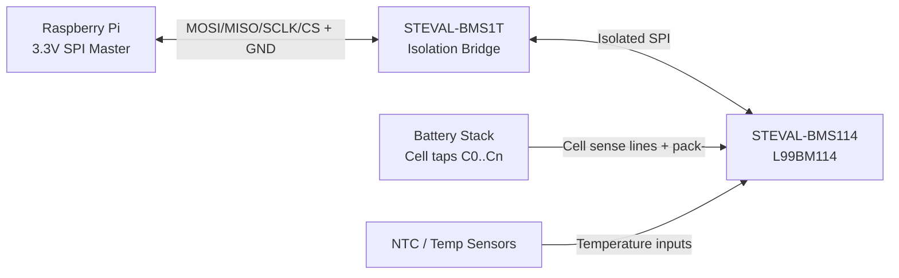

# BMS Dashboard for STEVAL-BMS114 + STEVAL-BMS1T (Raspberry Pi)

This project provides a practical dashboard stack for an rPi that talks to an
**ST L99BM114-based evaluation board (STEVAL-BMS114)** through the
**isolated SPI bridge STEVAL-BMS1T**.

It includes:

- **Real-time measurements** acquired over SPI.
- **Historical measurements** persisted in SQLite.
- **Analytics** with cumulative charge/discharge energies and round-trip efficiency.
- **A built-in web dashboard UI** at `/` with live cards + historical charts.

## Relevant hardware docs

- STEVAL-BMS114 data brief: `steval-bms114.pdf`
- STEVAL-BMS114 getting started guide: `um3423`
- L99BM114 datasheet
- STEVAL-BMS1T (SPI to isolated-SPI bridge board)

> Tip: keep these PDFs next to your firmware notes and align register addresses/
> scaling in `bms_dashboard/spi_bms.py` to your exact revision.

---

## Hardware connection and power guide (with diagrams)

> ⚠️ **Safety first**: battery stacks can be dangerous (fire, shock, thermal runaway).
> Work with proper fusing, PPE, isolation, and lab procedures. If you are not
> qualified for HV battery work, do not wire this system without supervision.

### 1) System block diagram

```text
+---------------------+      SPI (3.3V logic)      +---------------------+
| Raspberry Pi        | <-------------------------> | STEVAL-BMS1T        |
| (Dashboard host)    |                             | SPI <-> Isolated SPI|
+---------------------+                             +----------+----------+
                                                                |
                                                                | Isolated SPI side
                                                                v
                                                      +---------------------+
                                                      | STEVAL-BMS114       |
                                                      | (L99BM114 BMS board)|
                                                      +----------+----------+
                                                                 |
                                                                 | Cell tap harness,
                                                                 | pack-, thermistors
                                                                 v
                                                      +---------------------+
                                                      | Battery Stack       |
                                                      | (series cells)      |
                                                      +---------------------+
```

### 2) Recommended wiring architecture



### 3) Power domains (important)

Keep **digital host power** and **battery monitor domain** conceptually separate:

1. **Raspberry Pi side**
   - Power rPi from its normal regulated PSU.
   - SPI signals are 3.3V logic.
2. **STEVAL-BMS1T bridge**
   - One side is powered by/grounded to the rPi logic domain.
   - The isolated side is referenced to the BMS board domain.
3. **STEVAL-BMS114 side**
   - Powered according to ST guide (board supply path and/or stack-referenced domain).
   - Connect battery stack only per ST harness instructions.

> Do **not** assume grounds can be shorted across isolation barriers unless ST
> documentation explicitly says so for your setup.

### 4) Practical connection checklist

Use this sequence to reduce bring-up risk:

1. **Bench-only first (no battery stack)**
   - Verify rPi ↔ STEVAL-BMS1T SPI lines and power.
   - Confirm `/dev/spidev*` appears and SPI transactions occur.
2. **Bridge to BMS board**
   - Connect isolated SPI side of STEVAL-BMS1T to STEVAL-BMS114.
   - Confirm communication frames/CRC with logic analyzer before battery attach.
3. **Add sensing harness**
   - Connect cell taps in correct order (`C0` to lowest reference, then ascending cells).
   - Add thermistors/sense inputs as required.
4. **Attach battery stack**
   - Ensure pre-charge/fusing and polarity checks are complete.
   - Only then enable real mode (`BMS_USE_MOCK=0`) and read telemetry.

### 5) Battery connection concept (series stack)

```text
Pack+ o----[Cell N]----[Cell N-1]---- ... ----[Cell2]----[Cell1]----o Pack-
          |              |                              |             |
         Cn            Cn-1                           C1            C0

C0..Cn are connected to the STEVAL-BMS114 cell sense inputs in strict order.
```

### 6) Minimum signals to double-check in the ST manuals

Because connector labels can vary by board revision, verify exact pin names from
UM3423 and schematics before wiring:

- SPI host side: `MOSI`, `MISO`, `SCLK`, `CS`, `GND`, logic supply
- Isolated SPI side: matched SPI lines + isolated return/reference
- BMS sense: `C0..Cn`, pack reference, temperature channels
- Any required enable/wakeup/reset lines

---

## Architecture

- `bms_dashboard/spi_bms.py`
  - `BMSReader` for SPI reads from L99BM114
  - `L99BM114Protocol` helper for framed command + CRC handling
  - `L99BM114Config` for register address/scaling customization
- `bms_dashboard/storage.py` — async SQLite persistence
- `bms_dashboard/analytics.py` — energy accumulation and efficiency
- `bms_dashboard/main.py` — FastAPI backend + built-in dashboard page

## Quick start

```bash
python -m venv .venv
source .venv/bin/activate
pip install -r requirements.txt
uvicorn bms_dashboard.main:app --host 0.0.0.0 --port 8000
```

Open: `http://<rpi-ip>:8000/`

By default, the app runs in mock mode so you can test without hardware:

```bash
export BMS_USE_MOCK=1
```

## Use real STEVAL-BMS114 hardware

1. Enable SPI on Raspberry Pi:
   ```bash
   sudo raspi-config
   # Interface Options -> SPI -> Enable
   ```
2. Verify SPI nodes:
   ```bash
   ls /dev/spidev*
   ```
3. Wire rPi SPI ↔ STEVAL-BMS1T ↔ STEVAL-BMS114 per ST documentation.
4. Disable mock mode:
   ```bash
   export BMS_USE_MOCK=0
   ```
5. Start API/dashboard.

## API endpoints

- `GET /` dashboard page (real-time cards + history chart)
- `GET /api/live` latest measurement + analytics snapshot
- `GET /api/history?limit=500` historical samples
- `GET /api/analytics` efficiency metrics only

## Protocol integration notes (important)

`spi_bms.py` has a clear seam for L99BM114 register integration:

- confirm exact register addresses in `L99BM114Config`
- confirm SPI frame format + CRC polynomial/seed in `L99BM114Protocol`
- tune scaling/offsets in `read_measurement()`

Because board/firmware revisions can differ, treat current defaults as a
**starting template**, then validate against logic analyzer captures and ST docs.
